# Packet-Maze



An interactive training tool for budding network programming enthousiast's!

Are you a packet wizard? How's your packet craft? Find out with this interactive trainer!

Start off by doing a little setup (skip if you know what you're doing)

## Setup

There are two main dependencies - bcc and Python.

### BCC

Find your OS and follow their installation guide - it's fantastic:

- https://github.com/iovisor/bcc/blob/master/INSTALL.md

Once you have bcc setup on your system - run the following on the 'admin' or 'teacher' box.

### Python3

If you don't want to run things as sudo - the folloing might work:

```bash
sudo setcap CAP_NET_RAW+ep "$(readlink -f `which python3`)"
```

Otherwise, install the package and start `packet_maze --iface <iface to listen on>`

```bash
sudo su -
pip3 install packet-maze
packet_maze --iface eth0
```

## Play

Let students know your IP address and MAC address and have them 'play' the following levels.

### Register! : 0 - ARP - Link

Register by sending an **ARP reply** packet across the link with a source hardware address of **FE:ED:ME:13:37:55** to the interfaces broadcast address

### Baby Steps... : 1 - IP - Internet

Take the next steps in the wide new world of internet protocol by crafting an evil IP packet, with a payload containing your desired username **_max length of 10 bytes_**

### Are you Alive? : 2 - ICMP - Internet

Kick off the next stage by sending, as an IPv4 payload, a **type 13 ICMP packet** with an **id** value of hex 42, a **sequance** value of 88 and an **Originate timestamp** as the IPv4 address 1.3.3.7

### Yeet! : 3 - UDP - Transport

Traverse the transport layer by sending an **UDP packet** from and to port 55555 with a payload of **[x)0.0(x]**

### A Short Conversation. : 4 - TCP - Transport

Traverse the transport layer again by setting up a **TCP session** on port 55555, with the first data packet containing a payload of **ACK\x00\x01\x02\x03** which is PSH'd

### World-Wide-Webz : 5 - HTTP - Application

Finish by leveraging a well known application level protocol - **HTTP** - complete this by sending a **HTTP OPTIONS** request for all resources using **HTTP/13** at the destination port of 55555

# Docker

No - it's another layer of silly - you have to expose sys/modules and install the same kernel headers for docker to insert the module anyways - why do that? Open an Issue if you've a great reason.
